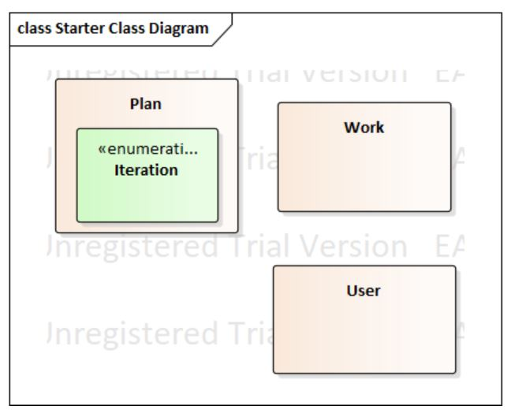

# Goal Management Service 명세서

## 1. 개요
### 1.1 프로그램 이름
- Goal Manage
### 1.2. 프로그램 목적
-   유저가 여러개의 목표를 만들고 관리할 수 있게 함
    
-   목표의 실시간 달성율을 확인하여 달성율을 높이기 위함
    
-   목표가 너무 높거나 낮으면 유저에게 난이도를 조정을 권유함
    
-   목표의 모델을 만들어 유의미한 결과값을 출력 얻음
    
-   강화학습을 통해 달성율을 학습하고 행동을 추천함
### 1.3. 단어 정의
- 달성율 (Completion Rate)
	- **목표를 성공한 횟수를 시도한 횟수로 나눈 값 (%단위)**
-   반복 주기 (Iteration)
	-   미리 정해진 목표의 반복주기 (예: 일간목표, 주간목표, 월간목표)
-   반복 단위 (Iteration Unit)
	-   미리 정해진 목표의 반복 단위 (예: 일, 주, 월)
-   작업 (Work)
	-   목표의 특정한 날짜의 실제 작업
### 1.4. Plan

|일|월|화|수|목|금|토| 
|--|--|--|--|--|--|--|
|  |4/1|4/2|4/3|4/4|4/5|4/6| 
|4/7|4/8|4/9|4/10|4/11|4/12|4/13|
|4/14|4/15|4/16|4/17|4/18|4/19|4/20|
|4/21|4/22|4/23|4/24|4/25|4/26|4/27|
|4/28|4/29|4/30|5/1|5/2|5/3|5/4|
|5/5|5/6|5/7|5/8|5/9|5/10|5/11|
|5/12|5/13|5/14|5/15|5/16|5/17|5/18|
|5/19|5/20|5/21|5/22|5/23|5/24|5/25|
-   1주차 (4/1 ~ 4/7)
    

-   프로젝트 설계
	-   데이터베이스 설계
-   2주차 (4/8 ~ 4/14)
	-   장고를 사용하여 RESTful API 제작
-   3주차 (4/15 ~ 4/21)
	-   서버에 데이터베이스 연결
	-   웹 프론트 엔드 부분 제작
-   4주차 (4/22 ~ 4/28)
	-   안드로이드Http 통신과 Tensorflow 안드로이드에서 사용하는 법 공부
	-   안드로이드 UI 설계
-   5주차 (4/29 ~ 5/5)
	-   안드로이드 뷰 제작
	-   안드로이드 서버 연결과 부가적인 기능 로직 구현(1/2)
-   6주차 (5/6 ~ 5/12)
	-   안드로이드 서버 연결과 부가적인 기능 로직 구현(2/2)
	-   머신러닝과 모델들에 대하여 공부(1/2)
-   7주차 (5/13 ~ 5/19)
	-   머신러닝과 모델들에 대하여 공부(2/2)
	-   머신러닝 모델 선택 후 모델 학습 실시
-   8주차 (5/20 ~ 5/26)
	-   추가적인 기능 구현
	-   QA(기능 검증)

### 1.5. 개발 환경
-   프로그램
	-   Android Studio 3.3.2 for Windows 64-bit
	-   PyCharm 2019 1.1 for Windows 64-bit
	-   PythonAnywhere
	-   sqlite3
	-   Jupyter Notebook
-   프로그래밍 언어
	-   Open Java 1.8
	-   Python 3.7
	-   HTML5
	-   CSS3
	-   JavaScript
-   타겟 소프트웨어
	-   Android Marshmallow(6.0)
	-   Website

## 2. 요구사항 (Requirements)
### 2.1. 기능적 요구사항 (Functional Requirements)
-   FR 0. 데이터베이스 관리
	프로그램은 User, Goal, Work, Prediction 4개의 테이블을 사용합니다. 그러므로 FR은 데이터베이스 관리를 위해 아래의 네 가지 기능들을 필요로 한다.
	-   생성(Create)
		- 테이블 안에 데이터를 생성하는 기능
	-   읽기(Read)
		- 테이블 안의 데이터를 읽는 기능
	-   수정(Update)
		- 테이블 안의 데이터를 수정하는 기능
	-   삭제(Delete)
		- 테이블 안의 데이터를 삭제하는 기능. User 테이블같은 일부 테이블의 데이터는 삭제하는데 제한 될 수도 있다.

-   FR 1. 목표 관리
	각 사용자들에 의해 목표를 생성, 수정, 삭제 그리고 달성율을 설정하는 기능이다. 모든 사용자들은 다음과 같은 행동들을 할 수 있다.
	-   상황 1. 목표 생성
		이 상황에서는, Goal 테이블이 사용 된다. 사용자들은 다음과 같은 데이터들을 입력해야 한다.
		-   목표 이름(Goal Title)    
		-   목표 반복 주기(Goal Iteration)
    -   상황 2. 목표 실행
	    이 상황에서는 목표 반복 주기에 따라 자동적으로 목표가 생성된다. 그리고 사용자들은 반드시 달성율을 설정해야 한다.

	-  상황 3. 목표 수정
		이 상황에서는 사용자는 프라이머리 키를 제외한 목표의 애트리뷰트를 수정할 수 있다.
	-   상황 4. 목표 삭제
	    이 상황에서 사용자는 특정 목표를 삭제 할 수 있다.
-   FR 2. 목표 통계
	이 FR은 목표들의 값의 통계치를 내서 그래프 형태로 보여준다. 이 서비스에서는 두 가지 통계 값을 그래프 형태로 제공한다.
	-   이전 데이터
	    목표들의 값들은 두 가지 형태로 보여진다.
		-   단일 데이터
		    단일 데이터는 목표의 달성율을 반복 단위를 기준으로 보여준다.
		-   다중 데이터
			다중 데이터는 특정 기간의 각각 목표의 달성율과 특정 기간의 전체 목표의 달성율의 두가지 형태로 제공 된다.
	-   예측 결과
		여러 목표들의 달성율을 기반으로 다음 반복 기간의 달성율을 예측한 결과를 제공한다.

-   FR 3. 달성율 예측
	이 FR은 다음 반복 기간의 달성율을 예측하는 기능이다. 달성율은 연속적이므로, 머신러닝 알고리즘의 회귀분석을 사용한다. 다음은 알고리즘 후보들이다.
	-   선형 회귀 분석 (Linear Regression)
	-   Lasso 회귀 분석 (Lasso Regression)
	-   능선 회귀 분석 (Ridge Regression)
	-   로지스틱 회귀 분석 (Logistic Regression)
	-   K-최단 이웃 회귀 분석 (K nearest neighbor Regression)

	예측의 정확성을 높이기 위해 다음 앙상블 학습들 중 하나를 쓸 것이다.
	-   Bagging Regressor
	-   Pasting
	-   Bagging
	-   Ada Boost
	-   Gradient Boosting

### 2.2. 비기술적 요구사항(Non-Functional Requirements)
-   NFR 1. 테이블 관리
    많은 사용자들이 서비스에 로그인 하였을 경우, 목표 디테일에 관한 쿼리를 처리하는데 많은 시간이 필요할 것이다. 그러므로 서비스는 이 문제를 해결하기 위해 로컬 캐시를 사용할 것이다. 사용자가 기기에 로그인했을 경우, 사용자와 관련된 전체 데이터를 기기에 자동으로 다운로드 한다. 그리고 사용자가 목표 추가, 수정, 삭제와 같은 행동을 한다면, 데이터는 로컬 서버에 저장 될 것이다. 그리고 사용자가 로그아웃 하면 전체 데이터는 로컬에서 삭제 한다.

## 3. 설계
### 3.1. Use-case Diagram
#### 

### 3.2. Class Diagram

####  

- Goal Class
	- Attribute
		-  Iteration : enum, 반복 주기의 종류; DAILY, WEEKLY, MONTHLY
		-   name : String, 목표의 이름
		-   iterationType : Iteration, 반복 단위
		-   frequency : int, 각 목표의 기간동안 목표 반복 횟수(ex. 주 1회, 월 3회)
		-   dailyFreq : int[], 일간 목표에 대한 목표 반복 횟수
		-   objectTime : int, 목표의 달성치
		-   completeDay : int, 목표의 성공 횟수
		-   startDay : Date, 목표의 시작 날짜
	-   Operation
		-   Goal(String name, int frequency, int objectTime, int completeDay, Date startDay, Iteration iterationType) : void, 주간 목표나 월간 목표의 생성자
		-   Goal(String name, int[] frequency, int objectTime, int completeDay, Date startDay) : void, 일간 목표의 생성자
		-   getCompletionRate(int comp) : int, 해당 목표의 전체 달성율을 리턴함
		-   createGoal(String name, Iteration iteration , int frequency, int objTime) : void, 목표를 만들고 로컬 DB에 저장함
		-   updateGoal(String name, Iteration iteration, int frequency, int objTime): void, 목표를 수정하고 그 값을 로컬 DB에 적용함
		-   deleteGoal(String name) : void, 로컬 DB에서 해당 목표를 삭제함
		-   downloadData() : void, 서버 DB에서 전체 데이터를 로컬DB로 다운로드함
		-   uploadData() : void, 로컬 DB의 전체 데이터를 서버 DB로 업로드함
		-   getLocalItemList() : ArrayList<Goal>, 로컬 DB의 목표 리스트를 리턴함
		-   isAvailable() : boolean, 데이터베이스에 목표가 추가될 수 있는지 없는지 확인함(무결성 제약조건 확인)
		-   isDataSynched() : Boolean, 로컬DB와 서버DB의 데이터가 동기화 되었는지 확인
-  Work Class
	-   Attribute
		-   name : String, 작업의 이름
		-   objectTime : int, 작업의 목표치(목표의 objectTime과 같음)
		-   completeTime : int, 해당 날짜의 작업에 대한 성공 횟수.
		-   date : Date, 작업의 날짜
	-   Operation
		-   Work(String name, int objectTIme) : void, 생성자. completeTime = 0, date = Today()의 기본값으로 초기화 된다.
		-   getCompletionRate(int obj, int comp) : int, 해당 날짜의 달성율을 리턴한다
		-   createWork(String name, int objectTime, int completeTime, Date date) : void, 작업을 생성하고 로컬DB에 추가한다.
		-   updateWork(String name, int objectTime, int completionTime, Data date): void, 작업을 수정하고 로컬 DB에 적용한다.
		-   deleteWork(String name, Date date) : void, 로컬DB에서 작업을 삭제한다
		-   downloadData() : void, 서버 DB의 데이터를 로컬DB로 다운로드한다.
		-   uploadData() : void, 로컬DB의 데이터를 서버DB로 업로드한다.
		-   getLocalItemList() : ArrayList<Work>, 작업의 로컬DB의 목록을 출력한다.
		-   isDataSynched() : boolean, 작업의 로컬 DB값과 서버 DB값이 동기화 되었는지 확인한다.
- User Class
	-   Attribute
		-   userId : String, 사용자의 ID, 프라이머리 키
		-   password : String, 사용자의 비밀번호
		-   name : String, 사용자의 이름

### 3.3. Relational DB Diagram
#### 